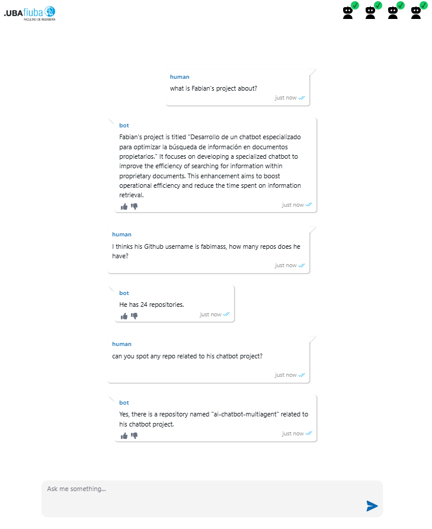

# AI Multiagent Chatbot

Hi! You've come across the final project for my post-graduate specialization in AI!

This is a versatile and intelligent chatbot powered by multiple specialized agents, designed to tackle a wide variety of tasks:

- RAG Agent: Retrieves and generates precise answers from documents using advanced retrieval-augmented generation techniques.
- SQL Agent: Dynamically queries databases to provide insights and data-driven answers.
- CSV Agent: Processes and analyzes CSV files to respond based on structured data.
- API Agent: Makes real-time API requests to fetch relevant information and deliver actionable responses.

With this multiagent architecture, the chatbot seamlessly integrates diverse data sources and APIs, making it a powerful tool for information retrieval.

Explore the code, customize the agents, and deploy your own multiagent chatbot tailored to your needs! You will find the [documentation here](https://github.com/fabimass/ai-chatbot-multiagent/wiki).

