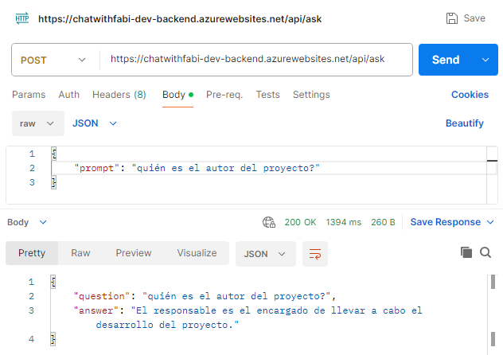
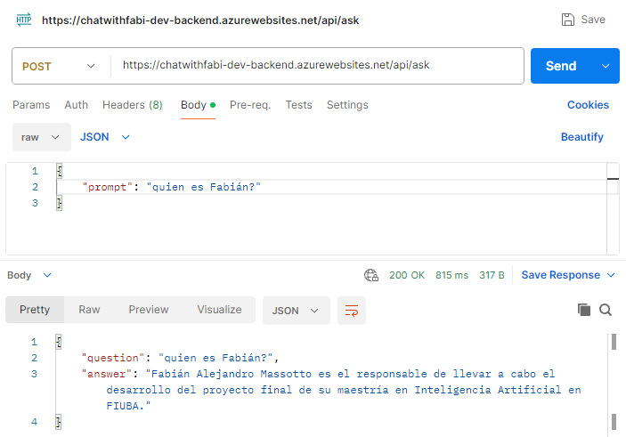
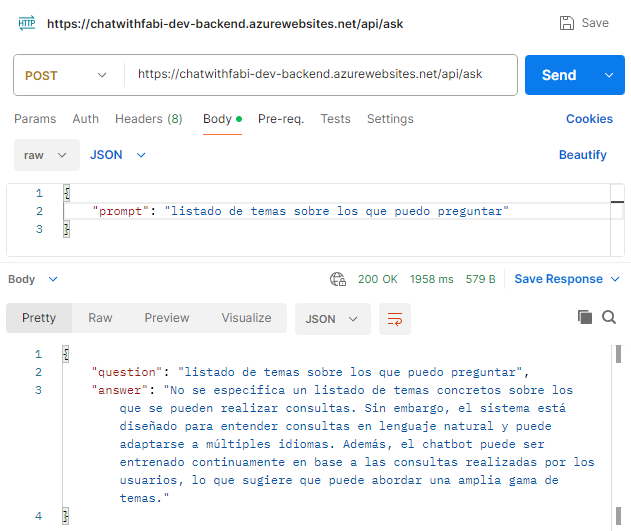

# Chatbot experimentation and enhancements documentation

This document details the experimentation stages, improvements, and observations for the RAG chatbot. The knowledge base consists of a single document outlining the planification for the final project of a master's degree. The goal is to refine the chatbot's ability to answer questions accurately and handle variations in question phrasing effectively.

### Stage 1: Initial setup

**Objective**: Assess the chatbot's ability to answer questions based on the document.

**Setup**:
- **Embeddings model**: Google AI embedding-001
- **System Prompt**:
```
"You are an assistant for question-answering tasks."
"Use the following pieces of retrieved context to answer the question."  
"If you don't know the answer, say that you don't know."  
"Use three sentences maximum and keep the answer concise." 
"\n\n" 
"{context}"
```

**Results**:

> The chatbot could answer questions but was overly sensitive to minor variations in question phrasing.

- **Question**: "quien es Fabian?"
- **Answer**: "Lo siento, pero con la información proporcionada no puedo determinar quién es Fabian."

  

- **Question**: "quien es Fabián?"
- **Answer**: "Fabián Alejandro Massotto es un alumno de la FIUBA y responsable del proyecto final en la Carrera de Especialización en Inteligencia Artificial."

  

- **Question**: "quien es el autor del proyecto?"
- **Answer**: "El responsable es el encargado de llevar a cabo el desarrollo del proyecto."

  

- **Question**: "cómo se titula el proyecto?"
- **Answer**: "No se menciona el título específico del proyecto en la información proporcionada."

  

- **Question**: "título del proyecto"
- **Answer**: "El título del proyecto es 'Desarrollo de un chatbot especializado para optimizar la búsqueda de información en documentos propietarios'."

  

> It also fails to respond to some questions.

- **Question**: "qué tecnologías se utilizan?"
- **Answer**: "No se conocen en profundidad las tecnologías a utilizar en el proyecto."

  

- **Question**: "cuándo se comenzó el proyecto?"
- **Answer**: "Lo siento, la información proporcionada no incluye la fecha de inicio del proyecto."

  

---

### Stage 2: Testing with OpenAI embeddings

**Objective**: Improve robustness by switching to OpenAI embeddings, aiming for greater consistency in responses.

**Setup**:
- **Embeddings model**: OpenAI ada-002
- **System Prompt**: No modifications from Stage 1

**Results**:

> OpenAI embeddings proved more consistent and less sensitive to minor variations.

- **Question**: "quien es Fabian?"
- **Answer**: "Fabian Alejandro Massotto es un ingeniero que está realizando su Trabajo Final de la Carrera de Especialización en Inteligencia Artificial."

  

- **Question**: "quien es Fabián?"
- **Answer**: "Fabián Alejandro Massotto es el responsable de llevar a cabo el desarrollo del proyecto final de su maestría en Inteligencia Artificial en FIUBA."

  

- **Question**: "quien es el autor del proyecto?"
- **Answer**: "El autor del proyect es el Ing. Fabián Alejandro Massotto."

  

- **Question**: "cómo se titula el proyecto?"
- **Answer**: "El proyecto se titula 'Desarrollo de un chatbot especializado para optimizar la búsqueda de información en documentos propietarios'"

  

- **Question**: "título del proyecto"
- **Answer**: "El título del proyecto de Fabian Alejandro Massotto es 'Desarrollo de un chatbot especializado para optimizar la búsqueda de información en documentos propietarios'"

  

> It is able to respond questions that couldn't handle before

- **Question**: "qué tecnologías se utilizan?"
- **Answer**: "El proyecto de Fabian utiliza tecnologías avanzadas como bases de datos vectoriales y chatbots de propósito general disponibles en el mercado. Además, los documentos son procesados y convertidos en vectores matemáticos llamados embeddings, que representan el significado subyacente de las palabras."

    

- **Question**: "cuándo se comenzó el proyecto?"
- **Answer**: "El proyecto comenzó el 23 de abril de 2024."

  

**Issue Identified**: 

> The chatbot struggled to answer broader questions regarding its own scope of knowledge.

- **Question**: "listado de temas sobre los que puedo preguntar"
- **Answer**: "No se especifica un listado de temas concretos sobre los que que se puedan realizar consultas. Sin embargo, el sistema está diseñado para entender consultas en lenguaje natural y puede adaptarse a múltiples idiomas. Además, el chatbot puede ser entrenado continuamente en base a las consultas realizadas por los usuarios, lo que sugiere que puede abordar una amplia gama de temas."

  

- **Question**: "sobre qué tópicos conoces?"
- **Answer**: "Puedo responder preguntas sobre diversos temas, incluyendo tecnología, historia, ciencia, cultura general, desarrollo de software y más. Si tienes una pregunta específica, por favor, házmela y trataré de ayudarte."

  

- **Question**: "cómo puedes ayudarme?"
- **Answer**: "Puedo ayudarte proporcionando respuestas rápidas y precisas a tus consultas, optimizando el proceso de búsqueda de información, y permitiéndote comunicarte de manera intuitiva utilizando lenguaje natural. En qué tema específico necesitas ayuda?"

  

---

### Stage 3: System prompt enhancement

**Objective**: Modify the system prompt to address the scope issue by explicitly instructing the chatbot on how to handle queries about its range of knowledge.

**Setup**:
- **Embeddings model**: OpenAI ada-002
- **System Prompt**:
```
"You are an AI assistant for question-answering tasks."
"You are able to answer questions related to Fabian's final project for his master degree in AI."
"If someone asks, 'What can I ask you about?' or other similar questions, respond with the above topics."
"If you're unsure, use the following pieces of retrieved context to answer the question." 
"If you don't know the answer, say that you don't know." 
"Use three sentences maximum and keep the answer concise."
"\n\n"
"{context}"
```

**Results**: 

> Adjusting the system prompt successfully guided the chatbot to recognize questions about its own scope of knowledge, improving the user experience by making the range of supported topics more explicit.

- **Question**: "listado de temas sobre los que puedo preguntar"
- **Answer**: "Puedes preguntar sobre el proyecto final de máster en IA de Fabián, específicamente sobre: 1. Los requerimientos funcionales del sistema. 2. La capacidad del sistema para entender consultas en lenguaje natural. 3. La interfaz gráfica para realizar consultas. 4. La experiencia del usuario y la recopilación de feedback. 5. El plan de proyecto de Fabián Alejandro Massotto. Si tienes alguna otra pregunta específica sobre estos temas, no dudes en preguntar."

  

- **Question**: "sobre qué tópicos conoces?"
- **Answer**: "Puedo responder preguntas relacionadas con el proyecto final de maestría en IA de Fabian."

  

- **Question**: "cómo puedes ayudarme?"
- **Answer**: "Puedo ayudarte con preguntas relacionadas con el proyecto final de máster en inteligencia artificial de Fabian. Esto incluye detalles sobre el proyecto, como su propósito, las ventajas sobre otros sistemas de inteligencia artificial, y cómo puede mejorar la eficiencia en la búsqueda de información en un entorno empresarial."

  

**Issue Identified**: 

> The chatbot shouldn't answer questions outside it's knowledge base.

- **Question**: "cuál es la capital de Argentina?"
- **Answer**: "La capital de Argentina es Buenos Aires."

  

- **Question**: "en qué equipo de fútbol juega Messi?"
- **Answer**: "Lionel Messi juega en el Inter Miami CF de la Major League Soccer (MLS)."

  

---

### Stage 4: System prompt further enhancements

**Objective**: Modify the system prompt to address out of scope questions.

**Setup**:
- **Embeddings model**: OpenAI ada-002
- **System Prompt**:
```
"You are an AI assistant for question-answering tasks."
"You are able to answer questions related to Fabian's final project for his master degree in AI."
"If someone asks, 'What can I ask you about?' or other similar questions, respond with the above topics."
"If you're unsure, use the following pieces of retrieved context to answer the question." 
"If you don't know the answer, say that you don't know."
"If a question does not relate to Fabian's project, respond with: 'This question falls outside of my knowledge base'." 
"Use three sentences maximum and keep the answer concise."
"\n\n"
"{context}"
```

**Results**: 

> Adjusting the system prompt successfully guided the chatbot to recognize questions outside of the knowledge base, hence refusing to answer.

- **Question**: "cuál es la capital de Argentina?"
- **Answer**: "Esta pregunta cae fuera de mi base de conocimientos."

  

- **Question**: "en qué equipo de fútbol juega Messi?"
- **Answer**: "Esta pregunta cae fuera de mi base de conocimientos."

  

---

### Stage 5: Chatbot memory

**Issue Identified**: 

> The chatbot doesn't have memory and thus it cannot answer regarding previous questions.

  

  

**Objective**: Store previous chats and provide them to the LLM when asking for a response.

**Setup**:
- **System Prompt**:
```
"You are an AI assistant for question-answering tasks."
"You are able to answer questions related to Fabian's final project for his master degree in AI."
"If someone asks, 'What can I ask you about?' or other similar questions, respond with the above topics."
"If you're unsure, use the following pieces of retrieved context to answer the question." 
"If you don't know the answer, say that you don't know."
"If a question does not relate to Fabian's project, respond with: 'This question falls outside of my knowledge base'." 
"Use three sentences maximum and keep the answer concise."
"\n\n"
"Context: {context}"
"\n\n"
"History: {history}"
```
- Implemented logic to provide the latest 2 question-answer pairs for the current user.

**Results**: 

> Adjusting the logic successfully empowers the chatbot to use previous questions and answers along with the context.

  

  